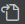
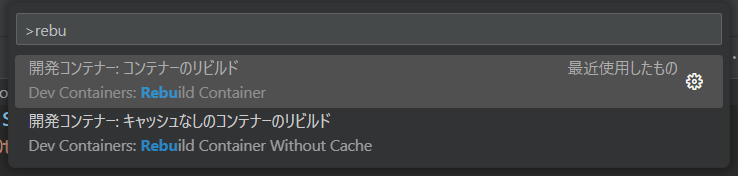

[戻る](../../../README.md)

# 01-02. Mac (arm) で開発をはじめる

arm の Mac 向けに、開発をはじめるまでの手順を記載します。

- [01-02. Mac (arm) で開発をはじめる](#01-02-mac-arm-で開発をはじめる)
  - [Git 環境を構築する](#git-環境を構築する)
    - [ターミナルを起動する](#ターミナルを起動する)
    - [参考：ターミナル（Bash）の基本操作](#参考ターミナルbashの基本操作)
    - [参考：基本的な Linux コマンド](#参考基本的な-linux-コマンド)
    - [Homebrew をインストールする](#homebrew-をインストールする)
    - [gh のインストール](#gh-のインストール)
    - [gh で GitHub にログインして認証情報をセットアップする](#gh-で-github-にログインして認証情報をセットアップする)
    - [git でのユーザ名と電子メールを設定する](#git-でのユーザ名と電子メールを設定する)
  - [Docker Desktop をインストールして WSL バックエンドを有効化する](#docker-desktop-をインストールして-wsl-バックエンドを有効化する)
  - [Visual Studio Code をインストールして、Dev Container 環境を構築する](#visual-studio-code-をインストールしてdev-container-環境を構築する)
    - [Visual Studio Code をインストールする](#visual-studio-code-をインストールする)
    - [code コマンドをインストールする](#code-コマンドをインストールする)
    - [Visual Studio Code の基本的なショートカット](#visual-studio-code-の基本的なショートカット)
    - [Visual Studio Code の基本的な設定を行う](#visual-studio-code-の基本的な設定を行う)
    - [必要な拡張機能をインストールする](#必要な拡張機能をインストールする)
      - [拡張機能「Dev Containers」のインストール](#拡張機能dev-containersのインストール)
  - [Visual Studio Code でリポジトリを開き、開発を行う](#visual-studio-code-でリポジトリを開き開発を行う)
    - [リポジトリを git clone する](#リポジトリを-git-clone-する)
    - [開発用のブランチを作成する](#開発用のブランチを作成する)
    - [Visual Studio Code を起動して、Dev Container 環境に接続する](#visual-studio-code-を起動してdev-container-環境に接続する)

## Git 環境を構築する

### ターミナルを起動する

公式ドキュメントに従って Spotlight を起動して、 `terminal` と検索してターミナルを開きます。  
<https://support.apple.com/ja-jp/guide/mac-help/mchlp1008/mac>

### 参考：ターミナル（Bash）の基本操作

| キー   | 説明                                     |
| ------ | ---------------------------------------- |
| Enter  | 入力したコマンドを実行します。           |
| Tab    | コマンドやファイル名を補完できます。     |
| ↓      | ひとつ後に入力したコマンドを入力します。 |
| ↑      | ひとつ前に入力したコマンドを入力します。 |
| Ctrl+c | 実行中のプログラムを停止します。         |
| Ctrl+a | カーソルを先頭に移動します。             |
| Ctrl+e | カーソルを末尾に移動します。             |
| Ctrl+k | カーソルより右側を削除します。           |
| Ctrl+u | カーソルより左側を削除します。           |
| Ctrl+r | コマンド履歴を検索します。               |
| Ctrl+l | 画面をクリアします。                     |

### 参考：基本的な Linux コマンド

| コマンド                                                | 説明                                                                 |
| ------------------------------------------------------- | -------------------------------------------------------------------- |
| pwd                                                     | 現在のディレクトリを表示します。                                     |
| cd [ディレクトリ名]                                     | 指定したディレクトリへ移動します。                                   |
| ls -la                                                  | 現在のディレクトリ内のファイルやディレクトリを一覧します。           |
| cp [コピー元ファイル名] [コピー先ファイル名]            | ファイルをコピーします。                                             |
| cp -r [コピー元ディレクトリ名] [コピー先ディレクトリ名] | ディレクトリをコピーします。                                         |
| mv [ファイル名] [移動先のファイル名]                    | ファイルを移動します。名前を変えたい場合もこのコマンドを使用します。 |
| rm -f [ファイル名]                                      | ファイルを削除します。                                               |
| rm -rf [ディレクトリ名]                                 | ディレクトリを削除します。                                           |
| mkdir -p [ディレクトリ名]                               | ディレクトリを作成します。                                           |
| less [ファイル名]                                       | ファイルの内容を閲覧します。終了するには `q` キーを押下します。      |

### Homebrew をインストールする

公式ドキュメントを参照して Homebrew をインストールしてください。  
<https://brew.sh/>

### gh のインストール

GitHub の操作、とくにプライベートリポジトリを扱うときの認証情報の解決に使用します。

公式ドキュメントに従い、コマンドを入力してください。  
<https://github.com/cli/cli/blob/trunk/README.md#homebrew>

### gh で GitHub にログインして認証情報をセットアップする

次のコマンドを実行します。

```zsh
gh auth login
```

ターミナル上に認証コードが表示されるので、コピーします。

Web ブラウザが起動するので、先ほどコピーした認証コードを入力してください。  
※ Web ブラウザが起動しない場合は、ターミナル上に表示された URL にアクセスしてください

ターミナルに戻り、Enter キーを押下して、セットアップを完了します。

### git でのユーザ名と電子メールを設定する

次のコマンドを実行します．

```zsh
git config --global user.name "YOUR_NAME"
git config --global user.email "YOUR_EMAIL"
```

## Docker Desktop をインストールして WSL バックエンドを有効化する

公式ドキュメントに従いインストールしてください。  
<https://docs.docker.com/desktop/setup/install/mac-install/>

## Visual Studio Code をインストールして、Dev Container 環境を構築する

Visual Studio Code は vscode と表記されることが多いです。

### Visual Studio Code をインストールする

公式サイトからインストーラをダウンロードして、ウィザードに従ってインストールしてください。  
<https://code.visualstudio.com/docs/setup/mac#_installation>

### code コマンドをインストールする

公式サイトに従って code コマンドを使用できるようにしてください。  
<https://code.visualstudio.com/docs/setup/mac#_launching-from-the-command-line>

ターミナルで code コマンドを実行し、 PATH が通っているか確認します。

```zsh
code .
```

### Visual Studio Code の基本的なショートカット

| ショートカット | 効果               | 説明                                                                                                                                                                       |
| -------------- | ------------------ | -------------------------------------------------------------------------------------------------------------------------------------------------------------------------- |
| ⌘+⇧+P          | コマンドパレット   | コマンドパレットを表示します。      Visual Studio Code やその拡張機能が提供する強力なコマンドをすばやく実行します。                                                        |
| fn+F2          | シンボルの名前変更 | 変数名や関数名を一括で変更します。文字列置換と異なり、シンボル（変数や関数など）を認識して一括で変更できるので、誤爆がありません。ファイルを跨いで変更することも可能です。 |
| fn+F12         | 定義へ移動         | 関数などの実装箇所にジャンプします。関数のシグネチャやコメント、実装内容を確認したくなったときに使用します。                                                               |

### Visual Studio Code の基本的な設定を行う

Visual Studio Code を起動し、`⌘+,` を入力します。

「設定」タブが開かれるので、画面右上のをクリックし、JSON 形式の設定ファイルを開きます。

次の内容を入力して保存してください。

```json
{
    "terminal.integrated.allowChords": false,
    "files.eol": "\n",
    "files.trimTrailingWhitespace": true,
    "[markdown]": {
        "files.trimTrailingWhitespace": false
    },
    "files.autoSave": "afterDelay",
    "files.autoSaveDelay": 1000,
    "editor.mouseWheelZoom": true
}
```

`files.autoSave` の値は `afterDelay` 以外でもよいですが、無効にはしないでください。
「ファイルの保存を忘れてしまって、意図しない動作をする」状況を予防するためです。
※ 無効にする場合は自己責任で「保存忘れ」が起こらないように徹底してください

### 必要な拡張機能をインストールする

`⌘+⇧+X` を入力して、拡張機能メニューを表示します。

#### 拡張機能「Dev Containers」のインストール

Dev Container は Docker を利用した開発環境の共通化のしくみです。  
Dev Container を利用すると、開発時に利用するOS、OSにインストールされているツール、エディタの拡張機能、フォーマッタや静的テストなどのエディタの設定などをチームで統一できます。  
開発環境のセットアップ手順の簡略化や、個人ごとの環境の違いによるトラブルの防止に役立ちます。

検索ボックスに「ms-vscode-remote.remote-containers」と入力します。  
検索結果の一覧から「Dev Containers」を選択し「インストール」ボタンを押下します。

## Visual Studio Code でリポジトリを開き、開発を行う

### リポジトリを git clone する

ターミナルを開いて git clone を行います。

次のコマンドで clone したいディレクトリへ移動して、リポジトリを clone します。

```zsh
cd ~/workspace/github.com/one-scope
git clone https://github.com/one-scope/example-repository
```

clone できたら、リポジトリのディレクトリへ移動します。

```zsh
cd ./example-repository
```

### 開発用のブランチを作成する

次のコマンドでブランチを作成し、作成したブランチに移動します。
ブランチはプルリクエストと対応付けて、ひとつのまとまった機能開発やバグフィックス単位で作成します。

```bash
git checkout -b my-branch
```

※ `git branch` コマンドを実行すると、現在のブランチを確認できます。

### Visual Studio Code を起動して、Dev Container 環境に接続する

clone したリポジトリのルートディレクトリで次のコマンドを実行して Visual Studio Code を起動します。

```bash
code .
```

Visual Studio Code が起動したら、`⌘+⇧+P` を入力し、コマンドパレットを表示します。

コマンドパレットから `Dev Containers: Rebuild and Reopen in Container` を実行します。  
コマンドパレットの入力は補完されるので、おそらく「rebuild」を入力すれば候補に出てきます。  


Docker イメージをビルドするため、しばらく時間がかかります。  
※ 画面右下の  をクリックすると、ビルドログを確認できます。

画面左下の表示が  となれば成功です。
