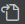

[戻る](../../../README.md)

# 02-01. 入門 Visual Studio Code

- [02-01. 入門 Visual Studio Code](#02-01-入門-visual-studio-code)
  - [Visual Studio Code とは](#visual-studio-code-とは)
  - [基本的なショートカット](#基本的なショートカット)
  - [基本的な設定](#基本的な設定)
  - [オススメの拡張機能](#オススメの拡張機能)
  - [参考書籍・Web サイト](#参考書籍web-サイト)

## Visual Studio Code とは

Visual Studio Code は主にプログラミングを行うためのテキストエディタです。  
Visual Studio Code は vscode と表記されることが多いです。  
vscode の発音は「ぶいえすこーど」です。

## 基本的なショートカット

| ショートカット | 効果               | 説明                                                                                                                                                                       |
| -------------- | ------------------ | -------------------------------------------------------------------------------------------------------------------------------------------------------------------------- |
| Ctrl+Shift+p   | コマンドパレット   | コマンドパレットを表示します。Visual Studio Code やその拡張機能が提供する強力なコマンドをすばやく実行します。                                                              |
| F12            | 定義へ移動         | 関数などの実装箇所にジャンプします。関数のシグネチャやコメント、実装内容を確認したくなったときに使用します。                                                               |
| F2             | シンボルの名前変更 | 変数名や関数名を一括で変更します。文字列置換と異なり、シンボル（変数や関数など）を認識して一括で変更できるので、誤爆がありません。ファイルを跨いで変更することも可能です。 |

## 基本的な設定

Visual Studio Code を起動し、`Ctrl+,` を入力します。

「設定」タブが開かれるので、画面右上のをクリックし、JSON 形式の設定ファイルを開きます。

次の内容を入力して保存してください。

```json
{
    "terminal.integrated.allowChords": false,
    "files.eol": "\n",
    "files.trimTrailingWhitespace": true,
    "[markdown]": {
        "files.trimTrailingWhitespace": false
    },
    "files.autoSave": "afterDelay",
    "files.autoSaveDelay": 1000,
    "editor.mouseWheelZoom": true
}
```

`files.autoSave` の値は `afterDelay` 以外でもよいですが、無効にはしないでください。  
「ファイルの保存を忘れてしまって、意図しない動作をする」状況を予防するためです。  
※ 無効にする場合は自己責任で「保存忘れ」が起こらないように徹底してください

## オススメの拡張機能

- [Error Lens](https://marketplace.visualstudio.com/items?itemName=usernamehw.errorlens) - エラー内容をその行に表示します。通常、エラー箇所にカーソルを合わせポップアップを表示しなければエラー内容がわかりませんが、この拡張機能を入れると何も操作することなくエラー内容を確認できます。
- [TODO Highlight v2](https://marketplace.visualstudio.com/items?itemName=jgclark.vscode-todo-highlight) - TODO コメントなどを強調表示します。また、ソースコードのどの位置に TODO コメントが残っているか、スクロールバーや TODO 一覧から確認できます。

## 参考書籍・Web サイト

- [【VSCode】よけいなものを消し去ってコードに集中しよう【ミニマリスト】](https://www.kurusugawa.jp/20210512-vscode-wide-area/) - vscode の画面を広く使うための Tips 集です。
