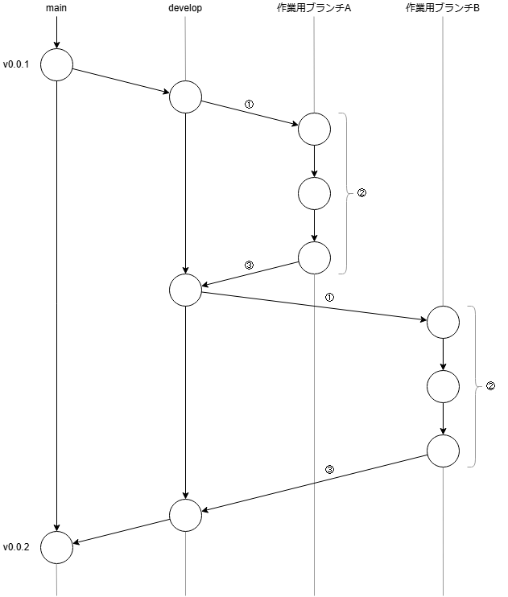
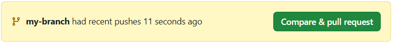
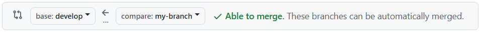
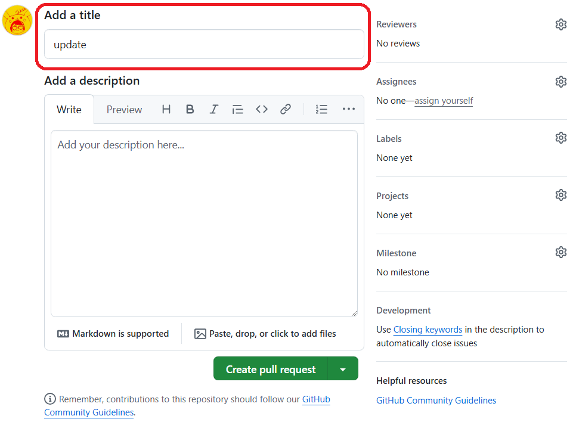
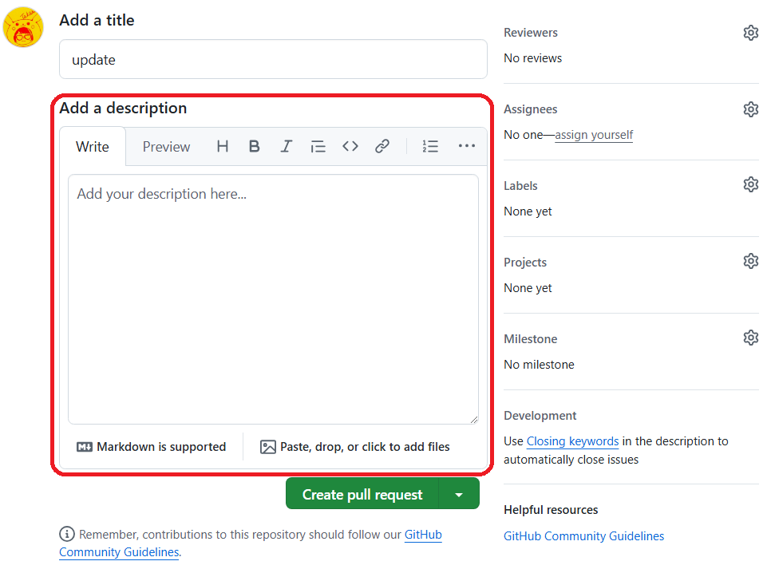
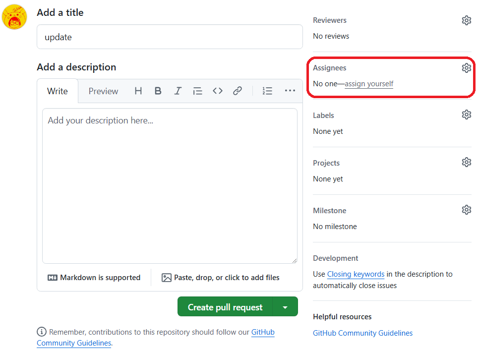
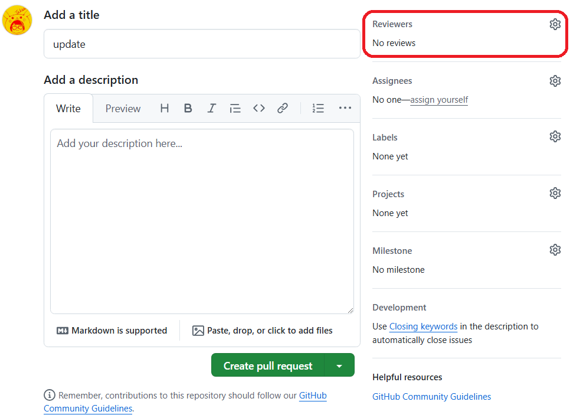
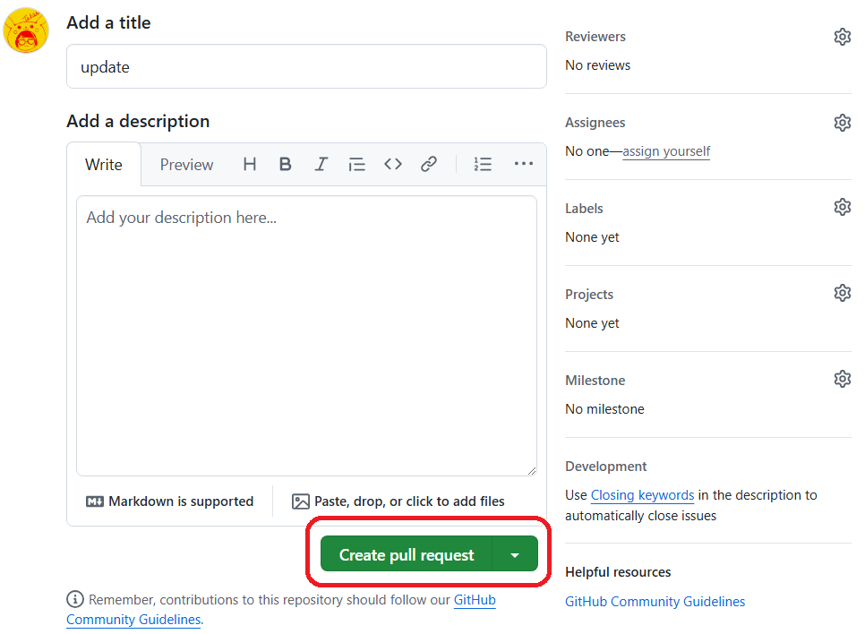

[戻る](../../../README.md)

# 02-03. 入門 Git

- [02-03. 入門 Git](#02-03-入門-git)
  - [Git とは](#git-とは)
  - [基本的な Git・GitHub の用語](#基本的な-gitgithub-の用語)
  - [基本的な git の操作](#基本的な-git-の操作)
  - [基本的なブランチとその用途](#基本的なブランチとその用途)
  - [基本的な開発フロー](#基本的な開発フロー)
    - [① 開発作業をはじめる](#-開発作業をはじめる)
    - [② 変更内容を push する](#-変更内容を-push-する)
    - [③ GitHub で PR を作成する](#-github-で-pr-を作成する)
  - [参考書籍・Web サイト](#参考書籍web-サイト)

## Git とは

Git はソースコードのバージョン管理のためのソフトウェアです。  
Git の発音は「ぎっと」です。

Git に対応するリポジトリサービスは複数ありますが、OneScope では GitHub を使用します。  
GitHub の発音は「ぎっとはぶ」です。

## 基本的な Git・GitHub の用語

| 用語           | 説明                                                                                                                                                                                                                                                                                                                                               |
| -------------- | -------------------------------------------------------------------------------------------------------------------------------------------------------------------------------------------------------------------------------------------------------------------------------------------------------------------------------------------------- |
| クローン       | リモートリポジトリ（GitHubなどにあるリポジトリ）を自分のローカル環境にコピーして、作業できるようにする操作のことです。<br/>クローンすると、リモートリポジトリの全てのファイルや履歴が自分のPCにコピーされ、ローカルで変更を加えたり、後でリモートに反映したりできます。                                                                            |
| コミット       | 変更したファイルをローカルリポジトリに保存する操作のことです。<br/>コミットを行うと、その時点でのファイルの状態が履歴として記録され、後で変更内容を確認したり、過去の状態に戻したりできるようになります。<br/>コミットには、変更内容を説明するメッセージが伴います。                                                                               |
| ドラフト       | プルリクエストがまだ完成していない状態で、他の人と共有したりレビューを依頼したりするための一時的な状態です。<br/>ドラフト状態のプルリクエストは、最終的な確認やマージの前に、作業中の変更内容を他のメンバーに見せてフィードバックをもらうために使います。<br/>ドラフトを解除した後、正式にレビューを受けてマージできるようにします。               |
| ブランチ       | リポジトリ内で並行して異なる作業を行うための分岐した作業領域のことです。<br/>ブランチを使うことで、メインのコードベースに影響を与えずに新しい機能の追加やバグ修正ができます。<br/>作業が完了したら、そのブランチを分岐元のブランチに統合（マージ）することができます。                                                                             |
| プッシュ       | ローカルリポジトリで行った変更（コミット）をリモートリポジトリ（GitHubなど）に反映させる操作のことです。<br/>プッシュすることで、他の人と変更を共有したり、リモートで最新の状態を保つことができます。                                                                                                                                              |
| プルリクエスト | あるブランチで行った変更をリモートリポジトリの他のブランチに統合（マージ）するように提案することです。<br/>通常、チームメンバーがコードをレビューし、問題がなければその変更を受け入れて（マージして）もらうために使います。<br/>プルリクエストは、変更内容の確認と議論を行うための重要な手段です。<br/>※ プルリク、PR と表記されることが多いです。 |
| マージ         | 異なるブランチで行った変更を1つのブランチに統合する操作のことです。<br/>例えば、新しい機能を別のブランチで作業した後、その変更をメインブランチに統合する際にマージを使います。<br/>これにより、複数の作業を1つのコードベースにまとめることができます。                                                                                             |
| リポジトリ     | プロジェクトのファイルやその履歴を管理する場所のことです。<br/>具体的には、コードやドキュメントなどのファイルが格納され、変更履歴（コミット）が記録される場所を指します。<br/>GitHubでは、リモートでホスティングされるリポジトリを使って、複数の人と共同でプロジェクトを進めることができます。                                                     |

## 基本的な git の操作

| コマンド                             | 説明                                                                     |
| ------------------------------------ | ------------------------------------------------------------------------ |
| git clone                            | リモートリポジトリをローカルにクローンします。                           |
| git pull                             | リモートリポジトリの内容をローカルに同期します。                         |
| git branch                           | ブランチを一覧します。                                                   |
| git switch [ブランチ名]              | 指定したブランチに移動します。                                           |
| git switch -c [ブランチ名]           | 現在のブランチから新しいブランチを作成し、作成したブランチに移動します。 |
| git status                           | コミットされていないファイルを確認します。                               |
| git diff                             | コミットされていないファイルの変更内容を確認します。                     |
| git add [ファイル名]                 | コミットしたいファイルを選択します。                                     |
| git commit -m "[コミットメッセージ]" | 選択したファイルをコミットします。                                       |
| git push origin [ブランチ名]         | 現在のブランチの内容をリモートリポジトリへ反映します。                   |

## 基本的なブランチとその用途

| ブランチ       | 用途                                                                                                                                                                                                                                                                                                                                                                                                                                                                                                                                                                  |
| -------------- | --------------------------------------------------------------------------------------------------------------------------------------------------------------------------------------------------------------------------------------------------------------------------------------------------------------------------------------------------------------------------------------------------------------------------------------------------------------------------------------------------------------------------------------------------------------------- |
| main           | リリースされた最新の状態です。<br/>機能は完全にテストされ動作することが期待されます。<br/>develop ブランチから main ブランチへ PR を出し、PR のマージをもってリリースとします。<br/>リリースごとにバージョン名を表すタグを付与します。<br/>main ブランチに直接コミットすることはありません。                                                                                                                                                                                                                                                                          |
| develop        | main ブランチから分岐した、開発中の最新の状態です。<br/>次のリリースに向けて、作業用ブランチから develop ブランチへ PR を出し、機能の追加やバグフィックスをマージしていきます。<br/>リリースできる状態となったら develop ブランチから main ブランチへ PR を出します。<br/>基本的に、develop ブランチに直接コミットすることはありません。                                                                                                                                                                                                                              |
| 作業用ブランチ | develop ブランチから分岐した、機能の追加やバグフィックスなど、ひとつの作業単位ごとのブランチです。<br/>ビルドが成功し、静的テストや単体テストでエラーが出ていないことが期待されます。<br/>作業用ブランチの命名ルールには様々な流派があります。参加するプロジェクトのルールに従ってください。<br/>開発中はこの作業用ブランチで作業を行います。基本的に作業用ブランチを複数人で共有することはありません。<br/>作業が完了したら作業用ブランチから develop ブランチへ PR を出します。<br/>作業用ブランチが develop ブランチへマージされたら、作業用ブランチは削除します。 |

## 基本的な開発フロー

実際の業務では次の図のように①～③の作業を繰り返すことで開発を進めていきます。  
  
以下のセクションで①～③の各作業を説明します。

### ① 開発作業をはじめる

現在のブランチが develop ブランチであることを確認します。

```bash
git branch
```

（現在のブランチが develop ブランチでない場合）develop ブランチへ移動します。

```bash
git switch develop
```

リモートリポジトリの最新の内容をローカルに同期します。

```bash
git pull
```

作業用ブランチを作成し、そのブランチへ移動します。

```bash
git switch -c [ブランチ名]
```

（vscode を使用する場合）vscode を起動して作業を開始します。

```bash
code .
```

### ② 変更内容を push する

変更内容を push する前に、push できる状態であるかをよく確認してください。  
例えば、次の確認を行います。

- ビルドが失敗しないか
- 動作確認を行っているか
- 静的テスト（linter）の警告が出ていないか
- テストが失敗しないか
- タイポがないか
- よけいなコメントが含まれていないか
- デバッグ用の Printf や console.log が残っていないか
- フォーマッタは適用されているか
- コーディング規約に違反していないか
- 脆弱性となり得るコードが含まれていないか
- アクセストークンなど機密情報が含まれていないか

現在のブランチが作業用ブランチであることを確認します。

```bash
git branch
```

（現在のブランチが作業用ブランチでない場合）作業用ブランチへ移動します。

```bash
git switch [作業用ブランチ名]
```

変更したファイルを確認します。

```bash
git status
```

変更内容が適切でコミットできる状態にあるか、差分を表示して確認します。

```bash
git diff
```

次のコミット（ステージング）に含めたいファイルを選択します。ファイル名は複数指定できます。  
※ コミットをつくっているあいだの状態・作業領域をステージングといいます

```bash
git add [ファイル名] [ファイル名] [ファイル名]...
```

次のコミット（ステージング）に含まれるファイルを確認します。

```bash
git status
```

（間違ったファイルを add してしまった場合）次のコミット（ステージング）からファイルを除外します。

```bash
git reset HEAD [ファイル名]
```

問題がなければ、コミットを行います。  
コミットメッセージは変更内容が具体的に区別できるような内容にしてください。  
例えば「指摘対応」や「修正」などはNGです。  
変更の理由や目的、背景が含まれるとよりよいです。

```bash
git commit -m "[コミットメッセージ]"
```

さいごに、コミットを行った作業用ブランチの内容をリモートリポジトリに反映します。

```bash
git push origin [ブランチ名]
```

### ③ GitHub で PR を作成する

Web ブラウザで GitHub のリポジトリを表示します。

ファイル一覧の上にある黄色のバナーで、作業用ブランチの「Compare & pull request」ボタンを押下します。  


base のブランチが develop、compoare のブランチが作業用ブランチとなっていることを確認します。  


Title を適切に記述します。  
Title だけを見てどのような PR なのかがわかる内容にします。  
多少長くなっても OK です。（コミットメッセージの要領です）  


Description を適切に記述します。  
この PR の背景や目的、変更方針、画面がある場合は変更前後のスクリーンショットや動画を記載します。  
また、レビュアーに対して特にチェックしてほしい箇所や、自身が行ったチェックの内容（レビュアーがチェックしなくてもよい箇所）が記載されているとよりよいです。  


Assignees に自分自身を指定します。（「assign yourself」を押下すると簡単です）  


Reviewers を適切に指定します。  
誰をレビュアーに指定するかはプロジェクトの方針に従ってください。  


さいごに、「Create pull request」ボタンを押下します。  


PR を作成できたら、正式にレビューを依頼する前に、まずは自分自身でレビューしてみましょう。  
変更意図がわかりにくい箇所などがあれば、自身でコメントしておくとレビュアーの助けになります。

## 参考書籍・Web サイト

- [サル先生のGit入門](https://backlog.com/ja/git-tutorial/)
