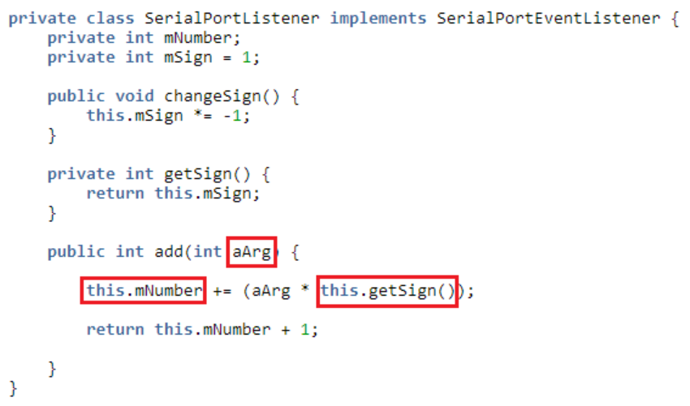
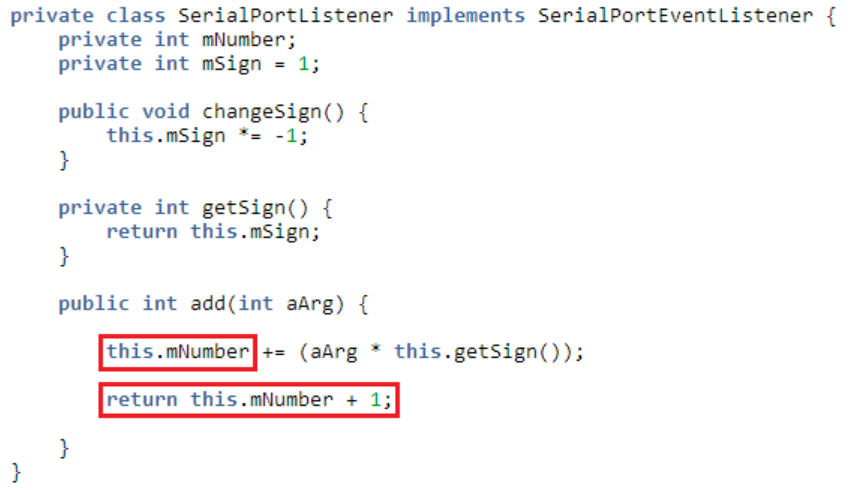

[戻る](../../../README.md)

# 03-03. 単体テストを学ぶ

- [03-03. 単体テストを学ぶ](#03-03-単体テストを学ぶ)
  - [テストケースの挙げかた](#テストケースの挙げかた)
    - [入力値分析を行う](#入力値分析を行う)
      - [入力値](#入力値)
    - [出力値分析を行う](#出力値分析を行う)
      - [出力値](#出力値)
    - [要因分析表をつくる](#要因分析表をつくる)
      - [同値分析と境界値分析](#同値分析と境界値分析)
      - [今回の要因分析表](#今回の要因分析表)
    - [テスト項目表をつくる](#テスト項目表をつくる)
  - [参考書籍・Web サイト](#参考書籍web-サイト)

## テストケースの挙げかた

今回は次のコードを例に、「add メソッド」に対する最も基本的なテスト設計を行います。

```java
private class SerialPortListener implements SerialPortEventListener {
    private int mNumber;
    private int mSign = 1;
  
    public void changeSign() {
        this.mSign *= -1;
    }
   
    private int getSign() {
        return this.mSign;
    }
  
    public int add(int aArg) {
        this.mNumber += (aArg * this.getSign());
        return this.mNumber + 1;
    }
}
```

### 入力値分析を行う

テスト対象メソッドの処理結果が変化する要因を分析します。

テスト対象メソッドの引数や、テスト対象メソッド内で使用しているフィールド、呼び出している外部メソッドの戻り値など、**テスト対象メソッド外部の要因で変化する値**を洗い出します。  


#### 入力値

- 引数： `aArg`
- フィールド： `this.mNumber`
- 外部メソッドの戻り値： `this.getSign()`

### 出力値分析を行う

テスト対象メソッドの実行により変化する値などを洗い出します。

テスト対象メソッドの戻り値や、テスト対象メソッド内で使用しているフィールド、呼び出している外部メソッドの引数などがこれにあたります。  


#### 出力値

- フィールド： `this.mNumber`
- メソッドの戻り値： `this.getSign()`

### 要因分析表をつくる

#### 同値分析と境界値分析

洗い出した入力値(要因)がどのような値をとり得るかを分析します。  
しかし、すべての値をテストすることはできませんので、以下の手順によりテストで使用する値を選択します。  
まずは仕様に則りメソッドの処理結果(出力値)が同じ状態となるグループ(**同値クラス**)を洗い出しましょう。→ **同値分析**  
そして次に、洗い出したグループ同士の境界となる値を列挙します。→ **境界値分析**

例えば、入力値「1～10」が正常な動作をするグループ(**正常系クラス**)であり、その他がエラーとなるグループ(**異常系クラス**)である場合は、異常系クラスと正常系クラスの境界値である「0」と「1」、「10」と「11」、それと正常系クラスが確かに同じ結果となることを確認するために、中間値である「5」をテストに使用します。

- 0 - 異常系クラス
- 1, 5, 10 - 正常系クラス
- 11 - 異常系クラス

#### 今回の要因分析表

要因分析表は、各入力値(要因)ごとにテストで使う値を列挙した表です。  
この表が最終的なテスト項目表のベースとなります。

今回は「aArg」が「1～10」の値をとる仕様として、テスト対象メソッドの要因分析表を作成しました。  
あらゆる値をとりうるフィールド「this.mNumber」は代表値として、負の値、ゼロ、正の値を挙げています。

| #   | 引数 | フィールド   | メソッドの戻り値 |
| --- | ---- | ------------ | ---------------- |
|     | aArg | this.mNumber | this.getSign()   |
| 1   | 1    | -10          | 1                |
| 2   | 5    | 0            | -1               |
| 3   | 10   | 10           | -                |

これをもとにテスト項目表をつくっていきます。

### テスト項目表をつくる

要因分析表に挙げた入力要素のとりうる値のすべての組み合わせをつくります。  
そして、その組み合わせのときの出力値を記述していきます。  
この1行ずつがテスト対象メソッドに対するテストケースとなります。

| #   | 入力値 |              |                  | 出力値       |                  |
| --- | ------ | ------------ | ---------------- | ------------ | ---------------- |
|     | 引数   | フィールド   | メソッドの戻り値 | フィールド   | メソッドの戻り値 |
|     | aArg   | this.mNumber | this.getSign()   | this.mNumber | -                |
| 1   | 1      | -10          | 1                | -9           | -8               |
| 2   | 1      | -10          | -1               | -11          | -10              |
| 3   | 1      | 0            | 1                | 1            | 2                |
| 4   | 1      | 0            | -1               | -1           | 0                |
| 5   | 1      | 10           | 1                | 11           | 12               |
| 6   | 1      | 10           | -1               | 9            | 10               |
| 7   | 5      | -10          | 1                | -5           | -4               |
| 8   | 5      | -10          | -1               | -15          | -14              |
| 9   | 5      | 0            | 1                | 5            | 6                |
| 10  | 5      | 0            | -1               | -5           | -4               |
| 11  | 5      | 10           | 1                | 15           | 16               |
| 12  | 5      | 10           | -1               | 5            | 6                |
| 13  | 10     | -10          | 1                | 0            | 1                |
| 14  | 10     | -10          | -1               | -20          | -19              |
| 15  | 10     | 0            | 1                | 10           | 11               |
| 16  | 10     | 0            | -1               | -10          | -9               |
| 17  | 10     | 10           | 1                | 20           | 21               |
| 18  | 10     | 10           | -1               | 0            | 1                |

たったあれだけのコードなのに、18個のテストケースが挙げられました。  
やりすぎのように感じるかもしれませんが、ここまでやるのが基本です。

慣れてきたら不要なテストケースを削るようにしていきましょう。

## 参考書籍・Web サイト

- [知識ゼロから学ぶソフトウェアテスト](https://www.amazon.co.jp/dp/4798182435)
