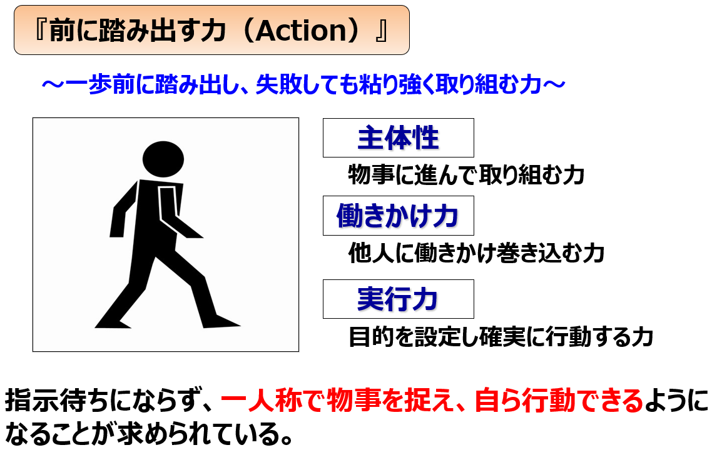
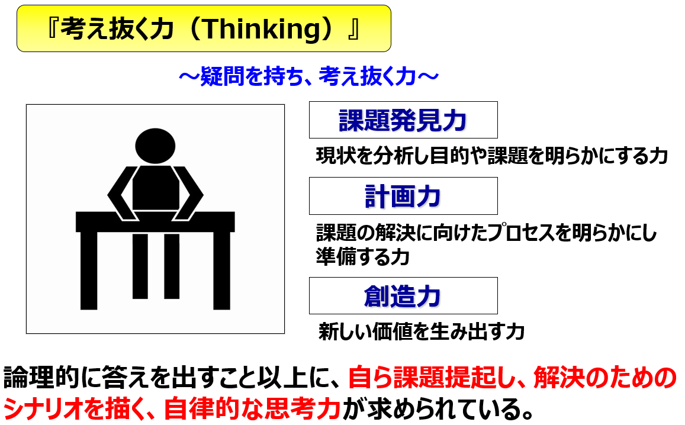
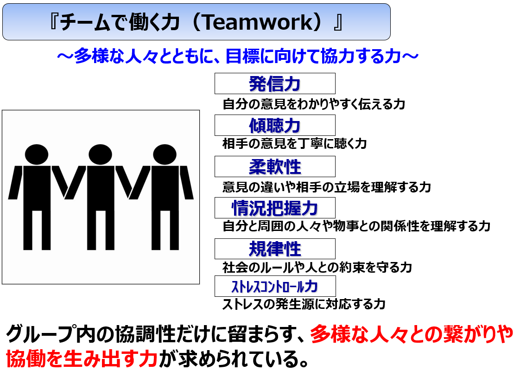
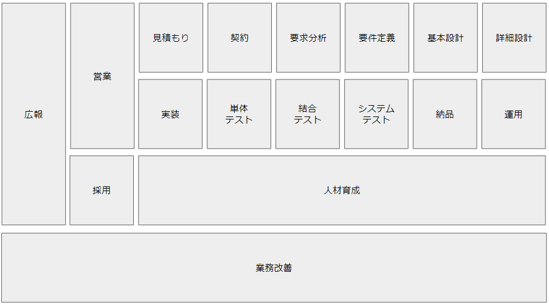

[戻る](../../../README.md)

# エンジニアの心得

社会人エンジニアとして成果をあげるために必要なマインドの獲得を目指します。

- [エンジニアの心得](#エンジニアの心得)
  - [社会人基礎力](#社会人基礎力)
  - [エンジニアの技能段階](#エンジニアの技能段階)
  - [プロのエンジニアを目指す](#プロのエンジニアを目指す)
    - [自分の待遇を決められるのは自分だけ](#自分の待遇を決められるのは自分だけ)
    - [プロのエンジニアの価値基準](#プロのエンジニアの価値基準)
    - [目標のリフレーミング](#目標のリフレーミング)
  - [プレイヤーとして一人前になるためのステップアップ](#プレイヤーとして一人前になるためのステップアップ)
    - [アサインされるのは”作業”ではなく”責務”](#アサインされるのは作業ではなく責務)
    - [ゴールを明確にし、タスクを洗い出す](#ゴールを明確にしタスクを洗い出す)
    - [事実と解釈を区別する](#事実と解釈を区別する)
    - [言語化できるまで考え抜く](#言語化できるまで考え抜く)
    - [意志決定と説明責任](#意志決定と説明責任)
    - [手を動かす前に仮説を立てる](#手を動かす前に仮説を立てる)
    - [内省力をつける、振り返り、自責思考](#内省力をつける振り返り自責思考)
    - [最高効率で勉強・キャッチアップする](#最高効率で勉強キャッチアップする)
    - [組織として継続的に勝ち続ける](#組織として継続的に勝ち続ける)
  - [参考書籍・Web サイト](#参考書籍web-サイト)

## 社会人基礎力

経済産業省が「社会人基礎力」として、業種・業界問わずすべての社会人が最初に身に付けるべき基礎的スキルを定義しています。  
「社会人基礎力」は次の3つの能力として説明されています。

経済産業省では、これらの「社会人基礎力」をキャリア意識・マインドを持ち続け、  
自己を認識してリフレクション（振り返り）しながら目的・学び・統合のバランスを図ることが、  
自らキャリアを切りひらいていく上で必要としています。

## エンジニアの技能段階

次の表は技能段階を5段階でモデル化したものです。（ドレイファスモデル）

| 段階   | 内容                                                                                                                                                                                                           |
| ------ | -------------------------------------------------------------------------------------------------------------------------------------------------------------------------------------------------------------- |
| 上級者 | 問題を探し出し、解決することができる。 根本的な原因を探し出したり、どこに注目して解決するべきかを決定するには苦労する。 プロジェクトの全体は見えているが、技能の全体は見えていない。                   |
| 中級者 | いま起こっている局所的な問題に対処するための情報をいち早く入手したいと考える。 理論や原則を学びたいとは思わない。 全体に対して無関心で、真剣に考える姿勢を見せない。                                   |
| 初心者 | 自分の行動のすべてに関して、それがうまくいくか判断することができない。 学びたい欲求は低く、目の前の目標を達成したいという願望が強い。 状況に左右されない確かなルールが存在する場合は仕事を達成できる。 |
| 熟練者 | 自己改善ができる。 状況を判断できるため、古くからの格言や原則、あるいは他プロジェクトの失敗談から効果的に学ぶことができる。 技能の全体に目を向ける。                                                   |
| 達人   | 膨大な経験を状況に応じて引き出し、応用できる。 常によりよい方法を模索している。 物事を問題について本質的であるかを直感的に判断できる。                                                                 |

一人前のエンジニアとして仕事をするには、少なくとも「上級者」以上の技能段階が必要です。

ドレイファスモデルでは「初心者」から「達人」へと技能段階があがるにごとに、次のように特性が変化します。

- よりどころとする対象が、ルールから直感に移行する
- 認識が、問題を一様な関連性を有する小部分の集合として認識するのではなく、ひとつの完全かつ無類の統一体として認識し、特定の小部分にのみ力を置くようになる
- 問題から遊離して存在する観察者から、システム自身の一部としてそれに関与する存在へと変化する

「達人」になるには、最低10年は努力する覚悟が必要です。  
1年の経験を単にあと9回繰り返しただけでは、経験の積み重ねにはなりません。  
**生半可ではない本気の努力が必要**で、ただ取り組むだけでは不十分です。

## プロのエンジニアを目指す

### 自分の待遇を決められるのは自分だけ

自分の待遇を決められるのは誰だと思いますか？  
上司？社長？  
違います。自分です。自分だと思ったほうがいいです。

たとえば160時間働いて手取りが10万円だったとして、待っていても評価されたりしません。  
これを会社のせいにしてグチグチ言っていても何も変わらないです。  
この状況を変えられるのは自分だけなんですよ。  
転職するにしても、評価してもらえるようにするにしても、自分で動くしかないんですよ。

お金や評価を得られる環境をつくるだけではなくて、  
自分の働きやすい環境や、自分のやりたいことができる環境をつくるにも、  
やっぱり自分で動くしかないんですよ。  
それが社会人です。

### プロのエンジニアの価値基準

コードを書くのが大好きでエンジニアになる人は多いです。  
おそらく、コードを書いているだけである程度楽しいハズです。悪いことではありません。  
しかし、プロのエンジニアとしてほんとうに大切なのは、仕事として成果を出すことです。  
成果に繋がらないコードを楽しく書き続けていても、それだけではプロのエンジニアとして評価されることはありません。  
仕事として成果を最大化することに楽しさの基準を置くことができると、プロとして評価される強いエンジニアになれます。

仕事とは、成果とはなんだろう。  
動くコードを書く他に、何が成果に繋がるんだろう。  
組織の中に自分に関係のない仕事はひとつもありません。  
業務フロー全体に目を向けて、いろいろな観点で考えてみてください。

### 目標のリフレーミング

エンジニアとして市場価値を高めるためには、コーディング以外にも目を向けて、  
できること、任せられること、責任を負えることを増やす必要があります。

次の図はエンジニアの仕事の全体像をざっくりと示したものです。  
（あくまで一例であって、これがすべてではない）  
  
「実装」が全体のごく一部でしかないことがわかります。

そして、実装はある程度できて当たり前のことであり、できる人が多いです。  
そんなレッドオーシャンの領域で実装”だけ”で価値を高めることはすごく難しいです。  
実装で100点を取れているところにさらに+10点して110点にしてもあまり価値にならなくて、  
同じ+10点するのなら、できる人が少ない領域、たとえば広報や営業で0点を10点にしたほうが重宝されます。

頼りになる人材になるためには、できることを増やすことです。  
業務フローを理解し、組織の中にどんな仕事があって何が足りないのか、これをよく観察して  
ステークホルダーにどんどん働きかけ、責任範囲を増やし、自分の価値を高めていく必要があります。  
そうしていく中で、自分のやりたいことができる環境が構築されていきます。

## プレイヤーとして一人前になるためのステップアップ

### アサインされるのは”作業”ではなく”責務”

業務上執り行うすべての作業には必ず目的と期限があります。  
目的や期限がないものは仕事ではありません。

アサインされるのは ”作業を行う” ことではありません。  
アサインされるのは作業の ”期限内に目的を達成し、期待する結果を得るという責務” です。

当たり前ですが、この責務を果たすためには、目的と期限を知らなければいけません。  
同じコーディングという作業でも、目的や期限は毎回違ったものになるでしょう。

たとえば、すでにリリースされているものに対する緊急のバグフィックスもあれば、  
勉強のために少し時間をかけてでも丁寧な実装をすることもありえます。  
前者であれば、結果としては多少汚くてもよいので最小最速でバグの流出が止まった状態が期待され、  
後者であれば、結果としては実際に実装した内容よりも人材としての成長が期待されます。  
このような期待される結果を期限内に実現することを担保するのが、責務を果たすということです。

まずは、目的と期限を正しく知ることからはじめましょう。  
目的や期限がわからなかったり曖昧である場合は、必ず確認してください。  
作業を開始したら、ホウレンソウを意識してください。ホウレンソウとは報告・連絡・相談のことです。  
期限内に目的を達成するために、あなたの責任で作業を進め、あなたの責任でホウレンソウを実行します。  
助けを求めるのもあなたの責任です。待っていても誰も助けてくれません。期限内に目的を達成するのはあなたの責務だからです。  
それが、責務を請け負うということです。

### ゴールを明確にし、タスクを洗い出す

解決すべき問題Aがあったとき、これをそのまま「問題Aを解決する」というタスクとして取り組むのはNGです。

- 問題Aはなぜ問題ですか？誰がいつどれくらいの頻度で困っていますか？
- 問題Aはどうして起こっていますか？原因は何ですか？何が課題ですか？
- 問題Aを解決したとき、どういう状態になっているべきですか？
- 問題Aを解決するためにもっともコスパのよい方法は何ですか？

などなど、考えるべきことは山ほどあります。  
これらを明確にしたうえで、はじめてタスクが洗い出せる状態になります。

タスクは問題を解決する最善の方法から逆算し、いくつかのステップに分割します。  
このとき 5W1H を意識して、具体的な完了条件が明確になるまで詳細化します。  
実際にすべてを言語化する必要はありません。関係者が認識できていればOKです。

### 事実と解釈を区別する

事実とは、プログラムの動作結果やデータなど、客観的に観測された唯一のものです。  
一方で解釈は、事実に対する個人の感想や推察で、人によって異なるもので、正しいものとは限りません。  
これは常に区別して取り扱う必要があります。

たとえば、「機能Aにバグがありました」という報告があったとします。  
この報告を受けた人は、機能Aについてログを確認したり、テストケースを見直したり、バグの再現や原因の特定のための作業をはじめるでしょう。

しかし、「バグがありました」が解釈だとしたらどうでしょう。  
実際に起こった事実としては「コンソール上に赤い文字が表示された」であって、この報告をした人は「赤い文字＝バグである」と解釈したわけです。  
ありえない話ではないですよね。

そして、機能Aにおいて赤い文字は正常な動作でした。  
ログを確認したり、テストケースを見直したり、在りもしないバグの再現や原因特定の作業をしていたわけです。  
その作業は、通常のバグの再現や原因特定の作業よりもはるかに困難で時間のかかる作業のはずです。  
なにせ、バグなど存在しないのですから。

事実と解釈を区別できなかったことで、コストを大きくムダにしてしまいました。  
このようなムダな作業の問題以外にも、大きな意志決定に関わる情報の中に事実と解釈を混同していたとしたらどうでしょう。  
取り返しのつかない致命的な損失になりかねません。

こういったことが起こらないように、常に事実と解釈を区別するように心がけましょう。  
とくに、テキストコミュニケーションでは行間を読むのが難しく事実と解釈の混同が起こりやすいです。

### 言語化できるまで考え抜く

ここでいう言語化は、誰かにうまく伝えることではありません。  
自分の考えを明確にすることです。  
「考える」という仕事に対するアウトプットとしての「言語化」です。  
言語化は文章である必要もありません。図や表でも、明確化できればなんでもよいです。脳内にしかなくてもOKです。  
大切なのは、言語化できるまで考え抜くことです。考えるという仕事に対して、きちんとアウトプットをつくることです。

当たり前ですが、どんな仕事でもアウトプットが無ければ、それを評価することはできません。  
アウトプットが無ければ、改善することも、反省することもできません。

考える力を養うにも、アウトプットが必要なんです。  
言語化しなければ、その考えの良し悪しを評価することはできません。  
言語化しなければ、正しく反省し改善することもできません。

アウトプットのない仕事は、仕事ではありません。  
言語化のない「考える」は”仕事”ではなく、「悩んでいる」という”状態”です。  
ちゃんと「考え」ましょう。それがすべてのスタートラインです。

### 意志決定と説明責任

業務上のすべての意志決定には説明責任が伴います。

自分が家を建てるとして、工務店さんから「なんとなくこれにしました」「よくわからないけどこうしました」と言われたらどう思いますか？  
ソフトウェアの世界でも同じです。  
コード1行にしたって、そこには意思決定があり、説明責任があります。

これは対お客さんへの説明責任だけでなく、チーム開発をする上でも必要なことです。  
我々がコードを読むとき、すべてのコードには理由があることを大前提として、その意図を汲み取ろうとします。  
意図のない無責任なコードは、コードを読む作業に著しい負荷を与えます。  
議論するにも、意図がなければできません。

コードを例に出しましたが、機能設計やワークフローの設計などでも同じです。  
繰り返しになりますが、業務上のすべての意志決定には説明責任が伴います。  
ちゃんと説明できるように、よく考え、責任をもって意志決定を行いましょう。

### 手を動かす前に仮説を立てる

手が速い人はなぜ手が速いのでしょうか。  
タイピングが速い？エディタの使いかたをよく知っている？IT知識がある？  
違います。

手が速い人は、手戻りがないのです。  
どうして手戻りなく作業できるのか。  
それは、手を動かす前に何パターンも仮説を立てて確信を得てから手を動かすからです。

逆に、手が遅い人はすぐに手を動かしはじめます。  
すぐにコードを書き換え、試行錯誤します。  
そうして、偶然うまくいった（ように見えるもの）を”完成”として PR を出します。  

これには大きく2つ問題があります。  
まず、どうしても試行錯誤の痕跡が残りやすいこと。  
プリントデバッグや、条件分岐を常に true にするようなコードを消し忘れ、”完成”したものに混じってしまいます。  
次に、アプリやサービス全体として見たときの整合性が崩れやすいこと。  
試行錯誤して偶然うまくいっただけなので、アプリやサービス全体としてどうあるべきかが考慮されません。どうしても歪になります。

この2つの問題は当然 PR などで指摘され、再び試行錯誤がはじまります。  
偶然ほんとうにうまくいくまで試行錯誤を繰り返すことになります。  
これでは終わりは見えません。このやり方では見積もりやスケジュールを立てることも不可能でしょう。  
また、PR などで指摘されなかった場合、これらは負債として残り続けます。  
プロジェクトの生産性はどんどん下がっていき、より大きな地獄が待っています。  

こうならないために、手を動かす前に仮説を立て、  
最小の労力でアプリやサービス全体として整合性を保ちつつ最大の成果を出すための方法を考えるのです。  
それは、コード設計かもしれないし、機能の仕様かもしれないし、ステークホルダーとの要件の調整かもしれません。

※ 手が速い人はこうした仮説検証の過程で手が遅い人よりも考える回数（＝経験値）が圧倒的に多いです。  
　 この圧倒的な経験値の差が "伸びる人" と "伸びない人" の差です。

### 内省力をつける、振り返り、自責思考

とにかく毎日、必ず振り返りをしてください。  
成功や失敗の要因を熟考してください。  
日々の貴重な経験を、それだけで終わらせないでください。  
経験から気付きを得て、他の場面でも適用できる教訓として仮説を構築します。  
仮説を構築したら、次はそれを実際の業務に適用して検証します。

このサイクルのことを、経験学習モデルといいます。  
経験学習モデルは「具体的経験」→「内省的反省」→「概念化・抽象化」→「能動的実験」のサイクルで構成されます。

社会人として必要な学習は学校教育のように体系化されていません。  
もし学校教育のように学べるのであれば、誰もが億万長者になっているはずです。  
どんなベテランであっても、経験から学ぶ割合はかなり大きいです。  
むしろ成功している人ほど、積極的に経験から学んでいるはずです。  
日々をなんとなく過ごしていては、差が開く一方です。  
内省力を身につけ、振り返りを習慣にしてください。

また、「能動的実験」では実際の業務に適用するほかに有識者との壁打ちも有効な手段です。

### 最高効率で勉強・キャッチアップする

できることをやってもしかたがないので、できないことをやりましょう。  
じゃあ、業務上の価値に繋がるもので、自分のできないことってなんだろう？考えてみてください。

これを考えるには、業務フローが見えていないといけません。  
視点を変えて見てみましょう。  
まわりの人や目の前のコードではなく、業務全体を俯瞰する視点です。

そして、想像してください。  
今後、どのような業務が発生するか。  
業務フローの中でウィークポイント（組織としてフォローできていない要素、弱い要素）はどこか。

ウィークポイントが想像できたら、その中から習得するものをピックアップします。  
このときピックアップするべきなのは「習得しやすいもの」、もしくは「面倒くさいもの」です。  
「習得しやすいもの」は比較的簡単に価値をつくれるのでコスパがいいです。  
「面倒くさいもの」は誰もやりたがらないので価値が高く、かつ面倒なことはやればできるので習得も容易でコスパが高いです。

また、ウィークポイントは常に頭に置いておきましょう。  
情報収集など何かをインプットするときは、ウィークポイントに対してどう効くのかを基準に情報の価値を評価してください。  
そうすることで、次に何かを習得しようとするとき、頭の中にすでに地図ができている状態にできます。  
これまで難しいと思っていたものが、いつのまにか「習得しやすいもの」や「面倒くさいもの」になっていることもあります。

具体的な勉強方法としては、学びの段階を意識したアウトプット中心の勉強が必要です。  
学びの段階：知っている → 理解している → 実行できる → 教えられる

- ただ知るだけでなく、それがどのウィークポイントに対してどのように働くのかを理解する
- ただ理解するだけでなく、それを実行してウィークポイントを解決できる状態にする
- ただ実行できるだけでなく、それを言語化（もしくはライブラリ化）して組織としてウィークポイントを解決できる状態にする

知るより理解、理解より実行、実行より言語化、インプットよりもアウトプットを重視することでより効率よく深く勉強できます。  
※ 手っ取り早い勉強方法は、そのトピックを教えるセミナーを自ら主催することです

常日頃からこのように考え行動していくことが、最高効率で自分の価値を高める勉強・キャッチアップの方法です。

### 組織として継続的に勝ち続ける

組織に属するプロのエンジニアは、お金をつかってお金を生むためのコードを書きます。  
どれだけ正しいコードを書いたとしても、使ってもらえなければ意味がないです。  
アプリやサービスを使う実際のユーザーや、発注してくれたお客様に対してどのような価値を届けるのか、  
競合他社よりも自社のアプリやサービスのほうが価値が高いと自信をもって言えなければいけないです。

価値を届けるときの一般的な考え方として、QCD = Quality（品質）、Cost（コスト）、Delivery（納期）があります。  
QCD は案件ごとのスコープで考えてしまいがちですが、組織としていかに継続的に QCD を満たし続けられるか、いかにその仕組みをつくれるかが重要です。  
継続的に QCD を満たし続けられる仕組みがあって、はじめてプロのエンジニア組織として市場での戦いに参加できる状態になります。

バグのないコードを書くのは当然で、仕事をしながらいかに組織としての資産をつくれるかが重要です。  
例：保守しやすい資産としてのコード、ノウハウの蓄積、ライブラリ化、ワークフロー化、など

## 参考書籍・Web サイト

- [Team Geek](https://www.amazon.co.jp/dp/4873116309)
- [３分でわかる問題解決の基本](https://www.amazon.co.jp/dp/4534047479)
- [自分の意見で生きていこう: 「正解のない問題」に答えを出せる４つのステップ - 誰かの考](https://www.diamond.co.jp/book/9784478115220.html)
- [悩む力ー天才にすら勝てる考え方「クリティカル・シンキング」](https://www.kizuna-pub.jp/book/841/)
- [世界一流エンジニアの思考法](https://www.amazon.co.jp/dp/4163917683)
- [エンジニア基礎 ウィルゲート2024年度エンジニア新卒研修](https://speakerdeck.com/kotomin_m/ensiniaji-chu-2024nian-du-ensiniaxin-zu-yan-xiu-8571fa94-7ebf-44fc-a5cd-302763118aee)
- [達人プログラマー](https://www.ohmsha.co.jp/book/9784274226298/)
- [SPRINT 最速仕事術](https://www.amazon.co.jp/gp/product/447806699X/)
- [リーン・スタートアップ](https://www.amazon.co.jp/dp/4822248976)
- [プリンシプル オブ プログラミング](https://www.shuwasystem.co.jp/book/9784798046143.html)
- [プログラマが知るべき97のこと](https://プログラマが知るべき97のこと.com/)
- [ソフトウェアアーキテクトが知るべき97のこと](https://ソフトウェアアーキテクトが知るべき97のこと.com/)
- [プロジェクト・マネジャーが知るべき97のこと](https://プロジェクトマネジャーが知るべき97のこと.com/)
